# 초기 세팅 및 가이드

## 버전 정보
  
  


## + nvm 설치 방법 (Option)
[설치 링크](https://github.com/coreybutler/nvm-windows/releases)  
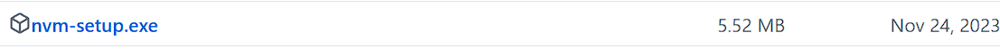  
별다른 설정 없이 설치 이후 power shell에 다음과 같이 입력 

```shell
nvm --version # 정상적으로 설치 되는지 버전 확인
nvm install 20.11.0 # 해당 버전 설치

nvm ls # 정상적으로 설치 시 20.11.0이 추가
nvm use 20.11.0 # node version 을 20.11.0(lts)로 사용
```

# + Vue Project 설치 방법 (Option)
```shell
npm install -g @vue/cli # vue 개발환경을 위한 cli를 global(프로젝트에 종속적이 아닌 npm path에 등록) 설치
npm create vue # vue 프로젝트 세팅 진행 (이후 필요한 옵션을 선택) 
```
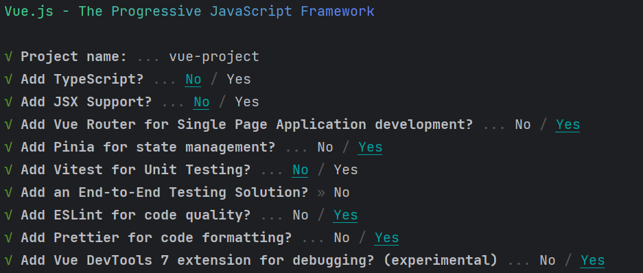

## Project Setup

```sh
npm install #프로젝트에 필요한 패키지 정보 설치 
```
프로젝트에 해당하는 정보는 package.json 에 있습니다!  
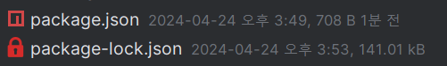

기초 세팅 시 다음과같은 dependencies를 가진 프로젝트를 설치하게됩니다.   
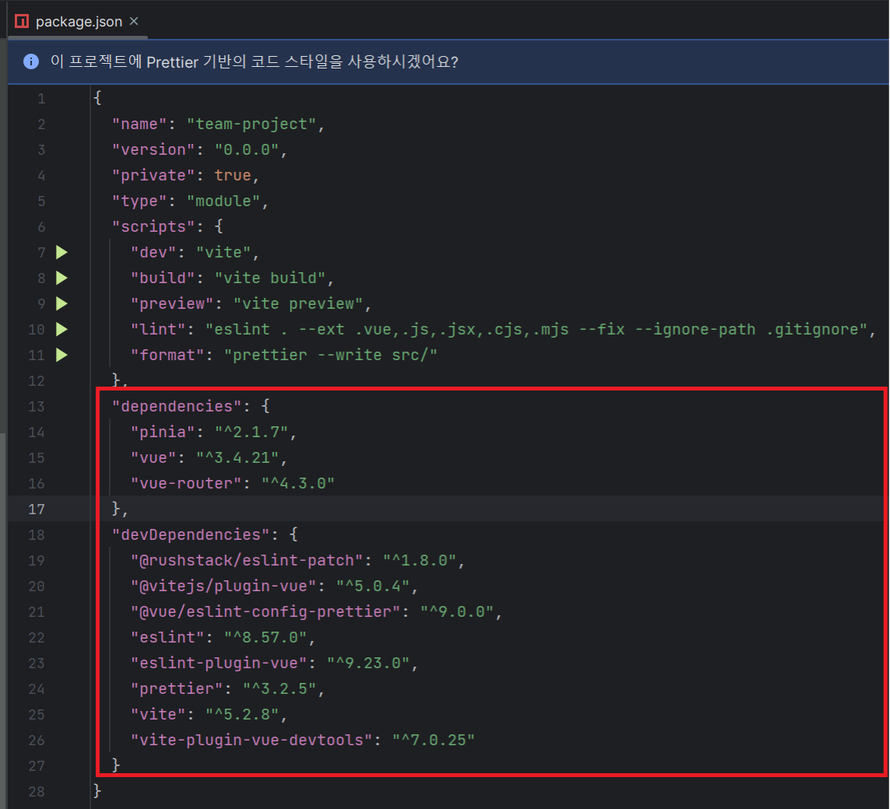

## Project 실행

```sh
npm run dev #package.json 에 있는 정보 중 dev를 실행
```   
    

## Project 구조

### install 실행 후 패키지 구조  
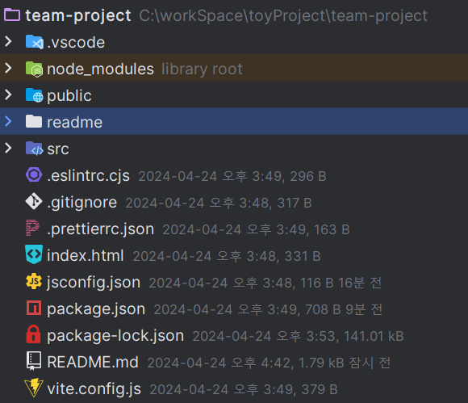


## src
실질적 어플리케이션을 구성하는 코드    


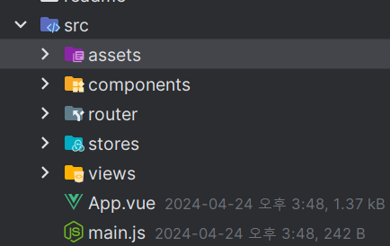
### assets 
- css 등 프로젝트 내부에서 사용될(직접 접근 불가능한) 파일을 위한 디렉토리

### components 
- vue 컴포넌트를 위한 디렉토리

### router 
- naver.com/hello/world 등 도메인 경로 설정 
  - vue-router 사용!

### stores 
 - 휘발성 변수(vue 페이지, 컴포넌트 data) 를 보강하기 위한 공통 상태 저장소
   - store 
     - 사용 시 local storage와 같은 역활로 import 후 사용 한 모든 vue context에서 접근 가능
     - local storage, web storage와 차이점은 브라우저에 저장되지 않고, vue contenxt에 저장되어 mode에 따라 다르지만, 브라우저 새로고침 시(컨텍스트에서 빠져 나올 시) 휘발됨
     - view 페이지로 라우팅 시 데이터 이동 혹은 / component props와 emit을 간소화 하고자 사용 하는 경우도 있음
     - 현 프로젝트에서는 piana 사용!

### views
 - 실질적으로 브라우저에서 보여주는 화면을 설정
 - 해당 vue 파일 에서 컴포넌트 및 에셋, js 파일을 import 받아 브라우저가 동 사용 
 - router 경로와 view 상대경로로 1:1로 매핑하는 경우가 보편적


## 설정 파일

### eslintrc
코드 린트 (기능 구현에 관한 코드에 대한 제한, 코드 퀄리티 보장)  
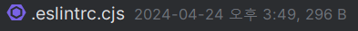

### prettier
코드 스타일 포매팅 (띄어쓰기 갯수 등 일관성 있고 깔끔하게)  
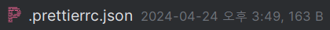

### jsconfig
자바스크립트  프로젝트에 대한 명시  
절대 경로에서 상대 경로로 이동(import 문 사용시) javascript es버전 등 설정  
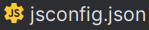

### vite
번들링(동적 import, min파일과  같이 minimize 를  위한 webpacking)을 위해 Vite(빠른 모듈 시스템)사용 시 설정 파일     
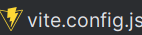


## 직접 접근하는파일

### public
favicon 등 프로젝트가 올라간 뒤에도 직접 경로 접근 가능한 파일 (서버에 올라갈 시 새로 말아 올려줘야됨!)  


### index.html
도메인을 찾을 시 최초 실행되는 html(naver.com = naver.com/index.html 을 찾음)  
해당 템플릿에서 vue 설정 및 서버를 구성하기 위한 main.js모듈을 실행
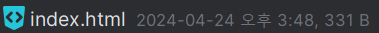